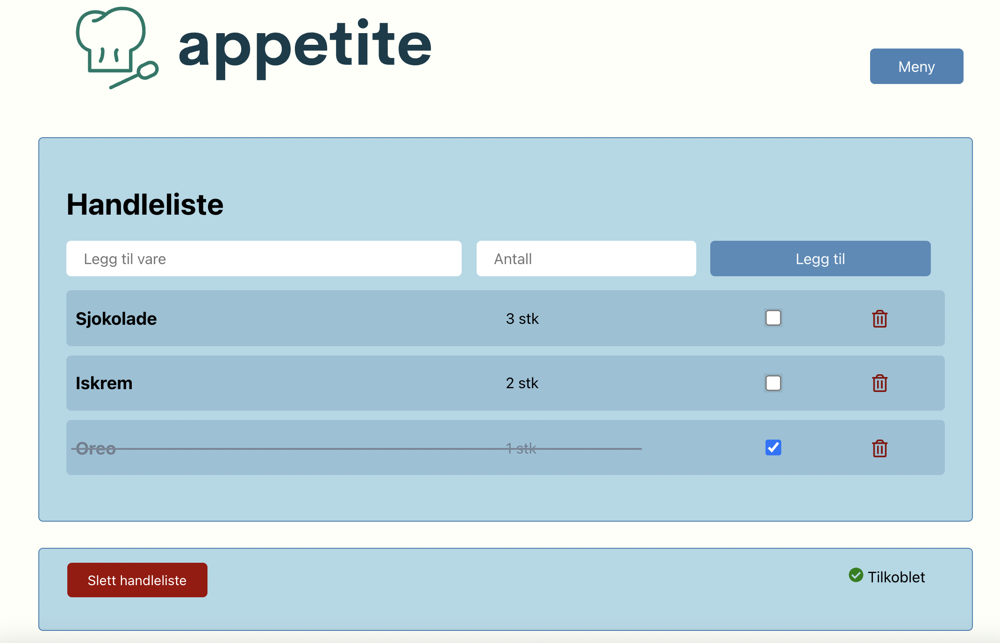

# appetite

Gruppeprosjekt i [IT1901 Informatikk prosjektarbeid](https://www.ntnu.no/studier/emner/IT1901) i 2. klasse på NTNU. Backend er laget med [Spring Boot](https://spring.io/projects/spring-boot) som klienten kommuniserte med via REST API. Den første versjonen av klienten ble skrevet i [JavaFX](https://openjfx.io/) mens den endelige versjonen er laget i [React](https://reactjs.org/). Automatiske tester er skrevet med [JUnit](https://junit.org/junit5/) og [Cypress](https://www.cypress.io/).

## Dette kodelageret inneholder

### [appetite-server/](appetite-server)
Kode til backend av applikasjonen, inkludert web-server og REST API-grensesnitt. Modulært Java-prosjekt med modul for domenelogikk (`core`), persistens (`json`) og web-server (`restapi`).

Førsteversjonen av brukergrensesnittet, laget med JavaFX, ligger også i `ui`-modulen her. Se også [Figma-modellen](https://www.figma.com/proto/fbMjONcPoa6XoCRGHM4k7m/IT1901?node-id=5%3A238&scaling=scale-down&page-id=0%3A1&starting-point-node-id=5%3A238&show-proto-sidebar=1), som ble brukt under utvikling av designet og deretter realisert via `ui`-modulen.

### [appetite-klient/](appetite-klient)
Klient-delen av applikasjonen, laget med React. Er avhengig av forbindelse med server for å lagre og hente tilstand (kan midlertidig lagre tilstand på egenhånd).

### [docs/](docs)
Dokumentasjon til app. Mye dokumentasjon ligger også i README-filer sammen med kodebasen.

## Kjøring av prosjektet
For å kjøre prosjektet i utviklermodus kjører man kommandoene `npm start` i [appetite-klient](/appetite-klient) og `mvn spring-boot:run` i [appetite-server](/appetite-server). 

For å kjøre prosjektet i produksjonsmodus, så kan man bruke `npm run build`i [appetite-klient](/appetite-klient). Dette bygger appen som er ment til å brukes av sluttbruker, og finnes [her](/appetite-klient/build/).

## Prosjektet i GitPod
Ved å åpne prosjektet i GitPod vil man få servert tre terminaler:
1) Henter nødvendige pakker for å få kjørt `react test` med Cypress. Denne terminalen sender signal til Terminal 2 når disse er hentet, og venter på signal fra Terminal 2, før den starter testene.
2) Denne terminalen venter på signal fra Terminal 1 og Terminal 3 før den konfigurerer localhost.js slik at gitpods url på port 8080 brukes av React. Installerer de nødvendige pakkene for Eeact. Samt starter React-appen. Sender signal til Terminal 1 (ti sekunder etter `npm start`).
3) Kjører `mvn install`, sender signal til Terminal 2, for derretter å starte webserver med `mvn spring-boot:run`.