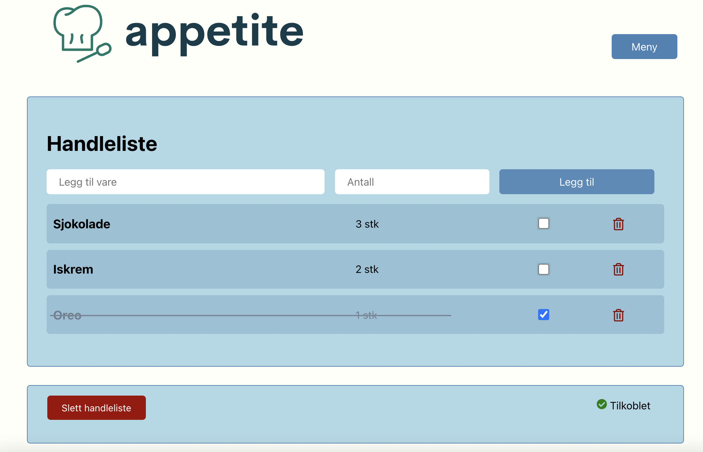

# appetite

Dette prosjektet bygger på inspirasjon fra _APPetite_-designcase fra TDT4180 Menneske-maskin-interaksjon (vår 2021). Sluttproduktet skal være en app som kan brukes til måltidsplanlegging og matvareinnkjøp for grupper (f.eks. familie, kollektivet eller venner).

Prosjektet følger en iterativ utviklingsprosess, og for øyeblikket utvikler vi en handleliste-funksjonalitet sammen med en modulbasert infrastruktur for videre utvikling.

Se også vår [bidragsguide](../docs/bidragsguide.md).

### Skjermbilde


### Brukerhistorier
Brukerhistorier vi for øyeblikket har definert ligger [her](../docs/brukerhistorier.md).

## Organisering av koden

Hvor modul har sin egen egen undermappe, som igjen inneholder:

|Beskrivelse|Sti|
|:----------|:--|
|Koden til modulen|src/main/java/|
|Eventuelle ressurser koden benytter|src/main/resources/|
|Testkode til modulen|src/test/java/|
|Eventuelle ressurser testene benytter|src/test/resources/|

I tillegg:
- På toppnivå i mappen til hver modul ligger en **pom.xml**-fil som inneholder metadata, konfigurasjoner og avhengigheter.
    - **pom.xml**-fil på rotnivå definerer det samme på overordnet nivå.
- Dette er samkjørt med **module-info.java**-filer i selve kodemappene for å håndtere hva hver modul eksporterer og importerer.

## Domenelaget
Håndterer logikk og validering knyttet til dataen i appen (inkl. tester). **ShoppingList**-klassen definerer en handleliste og **GroceryItem**-klassen definerer varer som kan ligge i handlelisten. Begge klassene spesifiserer metoder for opprettelse og manipulering disse objektene.

Detaljert dokumentasjon ligger i **[core](core/src/main/java/core)**-pakken.

## Persistenslaget
Håndterer skriving og lesing av dataene i domenelaget (inkl. tester). Data lagres i JSON-format via tilpasset implementasjon av [Jackson JSON Processor](https://github.com/FasterXML/jackson-docs).

Detaljert dokumentasjon ligger i **[json](json/src/main/java/json)**-pakken.

## REST-tjenesten
Håndterer mottak av forespørsler ved en HTTP-server, og omformer så foreslørselen til et kall på den respektive metoden i REST-tjeneste-objektet. Denne modulen inneholder både REST-tjeneste-objektet og oppsettet av serveren. 

Detaljert dokumentasjon ligger i **[restapi](restapi/src/main/java/restapi)**-pakken.

## Brukergrensesnittlaget
Håndterer logikk tilknyttet visning og handlinger på dataene i domenelaget. Brukergrensesnittet er laget med React og JavaScript, og viser en liste over varer som ligger i handlelisten samt operasjoner som kan utføres i handlelisten. Endringer blir kontinuerlig lagret.

Det nye grensesnittet bygget med React, samt detaljert dokumentasjon, ligger i **[appetite-klient](../appetite-klient)**-pakken.

Det gamle grenesnittet bygget med JavaFX, samt detaljert dokumentasjon, ligger i **[ui](ui/src/main/java/ui)**-pakken.

## Bygging med maven

- `mvn compile` - Kompilerer all kildekode
- `mvn test` - Kjører alle tester
- `mvn verify` - Kjører alle tester og genererer [JaCoCo](https://github.com/jacoco/jacoco)-rapport for testdekningsgrad
- `mvn install` - Installerer appen for lokal bruk
- `cd ui; mvn javafx:run` - Kjører appen

For å pakke inn ui-modulen inn i en installerbar pakke, kjøres
- `mvn javafx:jlink jpackage:jpackage`

i ui mappen.
Om man kjører dette på gitpod må man trolig installere fakeroot, som installeres ved å kjøre
- `sudo apt-get update`
- `sudo apt-get install fakeroot`


## UML-diagrammer 

### Sekvensdiagram
Et sekvensdiagram for et viktig brukstilfeller i appen, som viser koblingen mellom brukerinteraksjon og hva som skjer inni systemet ekskludert REST-API. Et sekvensdiagram for et kall etter implementeringen av REST-API finnes i [restapi-modulen](/appetite-server/restapi/src/main/java/restapi/README.md).

```plantuml

ui.ShoppingListController -> ui.ListChooserController: loadShoppingList(Familien)
ui.ListChooserController -> ui.ShoppingListController: openShoppingList()
ui.ShoppingListController -> core.ShoppingList: removeGroceryFromList()
core.ShoppingList -> core.GroceryItem: removeGroceryItem(Melk)
core.GroceryItem --> core.ShoppingList: groceryItem.remove(getName(Melk))
ui.ShoppingListController -> ui.ShoppingListController: updateBoard()
ui.ShoppingListController -> json.JacksonController: save()
json.JacksonController --> core.ShoppingList: save(Familien, familien.json)

ui.ListChooserController -> ui.ShoppingListController: createShoppingList()
ui.ShoppingListController -> core.ShoppingList: addGroceryToList()
core.ShoppingList -> core.GroceryItem: addGroceryItem(Boller, 6)
core.GroceryItem --> core.ShoppingList: GroceryItem(Boller, 6)
ui.ShoppingListController -> ui.ShoppingListController: updateBoard()
ui.ShoppingListController -> json.JacksonController: save()
json.JacksonController --> core.ShoppingList: save(Kollektivet, kollektivet.json)
ui.ShoppingListController -> ui.ShoppingListController: updateBoard()

```

### Arkitekturdiagram
Et pakkediagram for løsningen for viser hvordan appen er bygget opp av moduler, og hvordan disse modulene henger sammen. 

```plantuml

component "appetite-server" {

	package "appetite.core" {
		[ShoppingList] -> [GroceryItem]
	}

	package "appetite.json" {
		[JacksonController] ..> [ShoppingListDeserializer]
		[JacksonController] ..> [ShoppingListSerializer]
	}

	[ShoppingListSerializer] .> [jackson]
	[ShoppingListDeserializer] .> [jackson]

	database "JSON persistence" {
		folder "Home directory" {
			[appetite-db]
		}
	}

	[JacksonController] ---> [appetite-db]
	[ShoppingList] <... [JacksonController]

	package "appetite.restapi" {
		[ShoppingListApplication] <- [WebSecurityConfig]
		[ShoppingListApplication] <.. [ShoppingListController]
		[ShoppingListController] -> [ShoppingListService]
		
		[ShoppingListService] ..> [ShoppingList]
		[ShoppingListService] ..> [GroceryItem]
		[ShoppingListService] ...> [JacksonController]
	}

}

cloud {
	[REST API] <--> [ShoppingListController]
}

note top of [REST API]
	Levert av
	ShoppingListController
	i appetite.restapi
end note

component "react-klient" {
	[App] -> [API]
	[REST API] <--> [App]
}

[API] ..> [axios]
[App] ..> [React]

```

I en tidligere versjon av appetite brukte vi JavaFX for brukergrensesnitt. Denne modulen (`appetite.ui`) finnes fortsatt i prosjektet selv om det ikke lenger blir brukt. Et pakkediagram for denne delen av løsningen ser slik ut:

```plantuml

package "appetite.core" {
		[ShoppingList] -> [GroceryItem]
	}

	package "appetite.json" {
		[JacksonController]
	}

	database "JSON persistence" {
		folder "Home directory" {
			[appetite-db]
		}
	}

	[JacksonController] ---> [appetite-db]
	[ShoppingList] <... [JacksonController]

package "appetite.ui" {
	[ShoppingListApp] <-- [ShoppingListController]
	[ShoppingListApp] <-- [ListChooserController]

	[ShoppingList] <... [ShoppingListController]
	[ShoppingList] <... [ListChooserController]
	[GroceryItem] <... [ShoppingListController]

	[ShoppingListController] ...> [JacksonController]
	[ListChooserController] ...> [JacksonController]
	
}

[ShoppingListApp] .> [javafx]
```

### Klassediagrammer 
Klassediagrammer for de enkelte modulene ligger sammen med koden deres. Se [core-modulen](/appetite-server/core/src/main/java/core/README.md), [json-modulen](/appetite-server/json/src/main/java/json/README.md), [ui-modulen](/appetite-server/ui/src/main/java/ui/README.md) og [restapi-modulen](/appetite-server/restapi/src/main/java/restapi/README.md). Dokumentasjon for React-klienten ligger i [appetite-klient](/appetite-klient).
